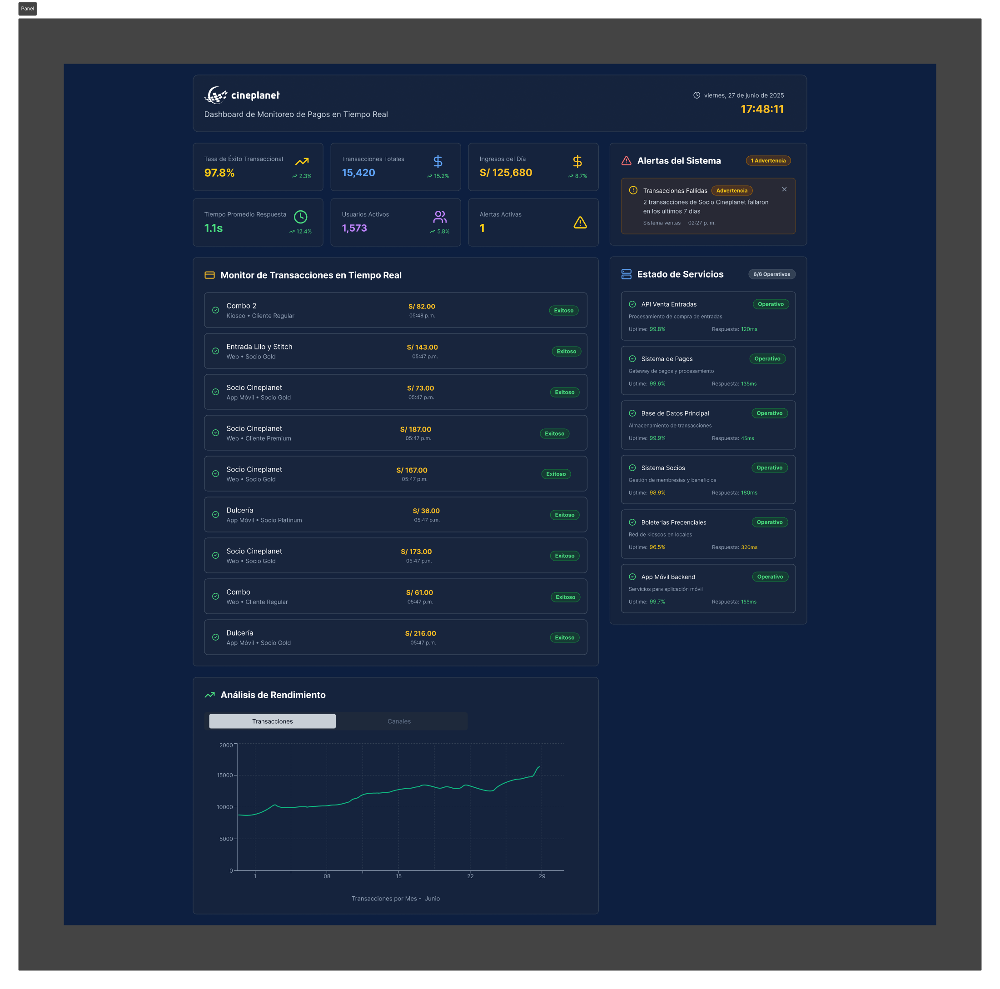
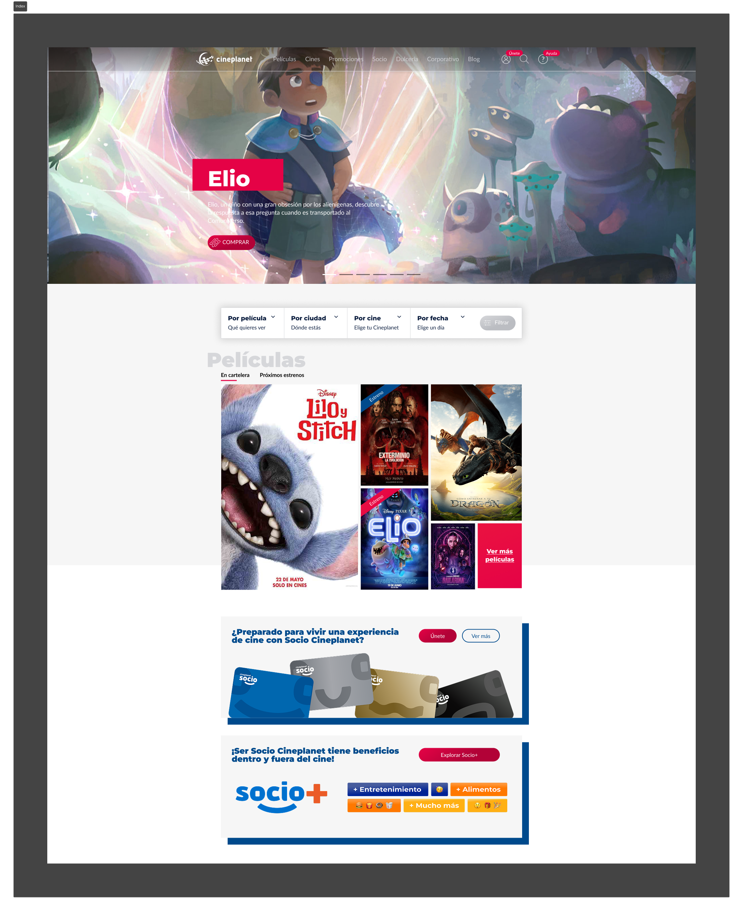
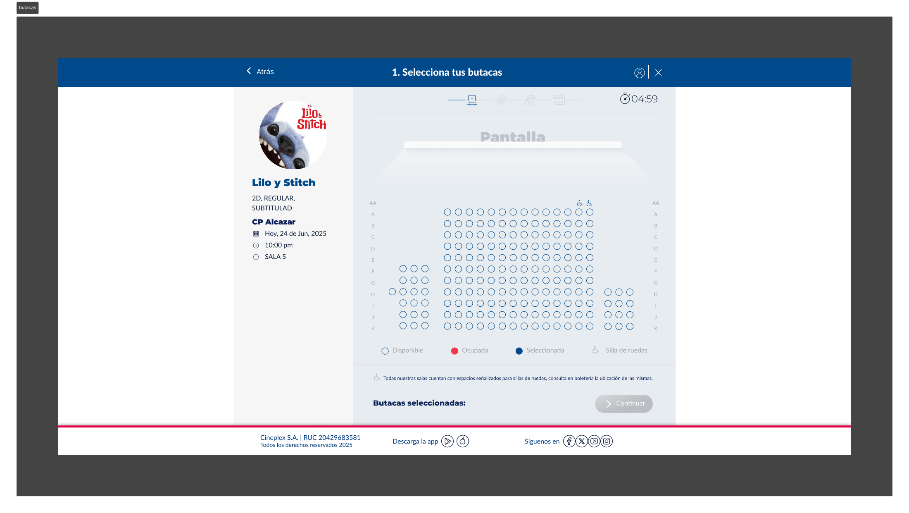
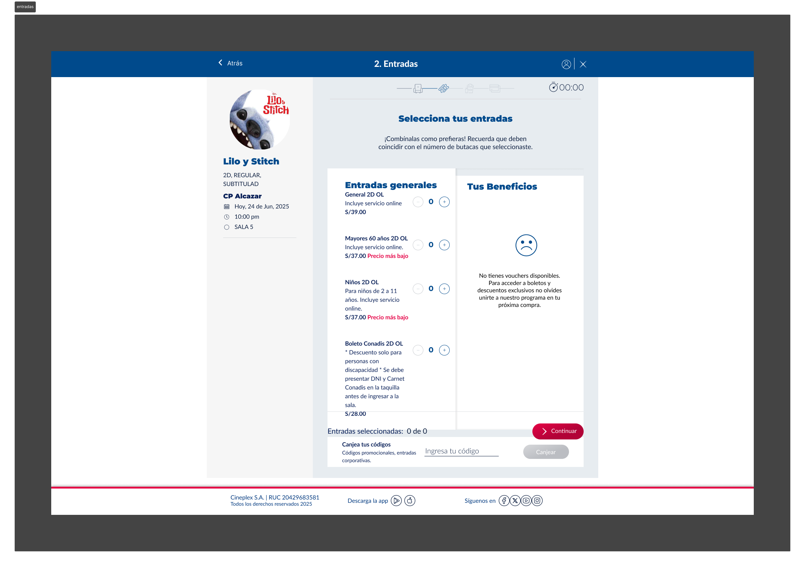
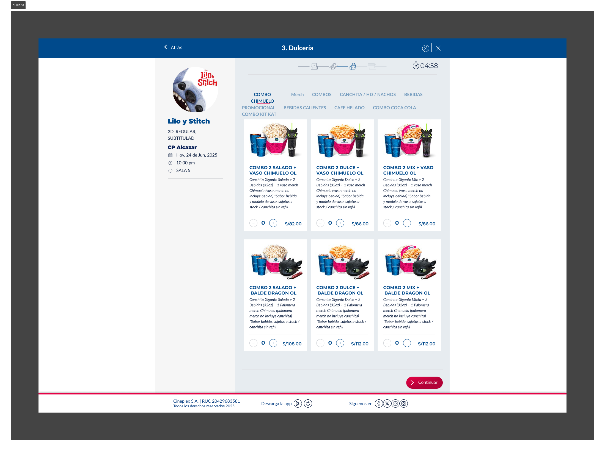
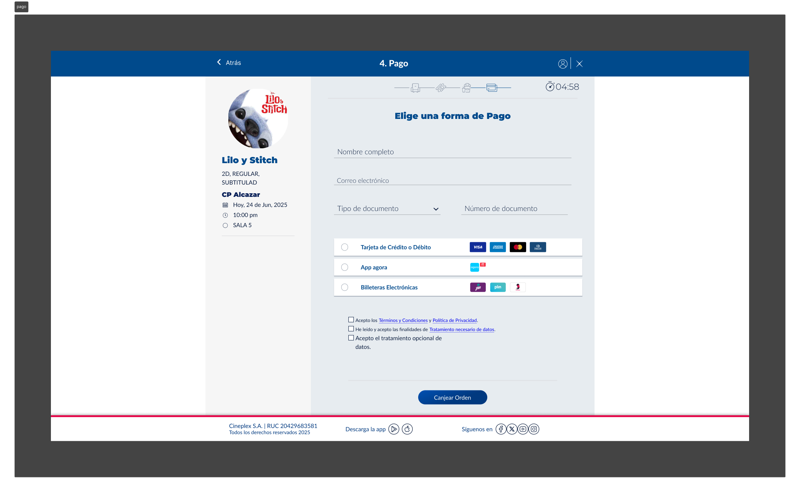
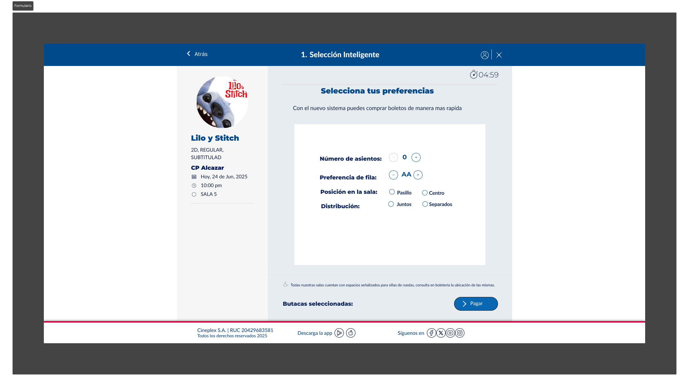

# 🎬 Optimización del Sistema de Pagos Digitales - Cineplanet

**🚀 Proyecto:** Optimización del Sistema de Pagos en Línea  
**🏢 Empresa:** Cineplanet S.A.  
**💻 Departamento:** Tecnología Digital  
**📅 Fecha:** 29 de junio de 2025  
**📋 Versión:** 2.0

---

> 💡 **IMPLEMENTACIÓN EXITOSA**: Panel de Monitoreo de Pagos en Tiempo Real desarrollado en Figma y puesto en producción

## 📊 1. Resumen Ejecutivo

El presente informe detalla el ciclo completo del proyecto de mejora acometido para resolver la crítica tasa de fallos del **35%** 📉 en la plataforma de pagos en línea de Cineplanet, la cual ocasionaba pérdidas anuales estimadas en **S/. 2.5 millones** 💸 y un severo deterioro de la experiencia del cliente. 

### 🎯 Solución Implementada
La solución se centró en el rediseño del ecosistema digital, materializándose en un **🖥️ Panel de Monitoreo de Pagos en Tiempo Real** desarrollado como prototipo en **Figma** y posteriormente implementado en producción para la gestión proactiva de operaciones de TI.

### 🏆 Resultados Excepcionales
Tras una fase de implementación piloto, los resultados superaron las expectativas:
- ✅ **Tasa de fallos:** 35% → 4% (-88.5%)
- ⚡ **Tiempo de procesamiento:** 45s → 12s (-73.3%)
- 📈 **Tasa de conversión:** +20 puntos porcentuales
- 💰 **ROI:** 71.4%

Este documento sirve como guía de uso del **Panel de Monitoreo implementado**, demostrando su rentabilidad y estableciendo un nuevo estándar de excelencia operativa y digital para la compañía.

## 🔍 2. Diagnóstico del Problema y Justificación del Proyecto

### 🚨 2.1. Definición del Problema

El ecosistema de ventas digitales de Cineplanet enfrentaba una crisis de fiabilidad. Un **35%** de todas las transacciones iniciadas con tarjetas de crédito o débito resultaban en error 💳❌, generando una experiencia de usuario frustrante y una interrupción directa del flujo de ingresos. 

**📊 Impacto crítico:**
- 📉 Tasa de abandono del **45%** en la etapa final de pago
- 📞 Volumen insostenible de quejas en canales de atención
- ⏰ Tiempo promedio de resolución: **48 horas**

### ⚠️ 2.2. Justificación Estratégica

La intervención era impostergable debido a su triple impacto negativo:

- 💰 **Financiero:** Pérdida directa de ingresos y aumento de costos operativos por gestión de incidencias
- 🏢 **Comercial:** Daño a la reputación de la marca y fuga de clientes hacia competidores con plataformas más estables
- ⚙️ **Operacional:** Sobrecarga de los equipos de atención al cliente y del personal en boleterías físicas

### 🎯 2.3. Objetivos del Proyecto

**🚀 Objetivo General:**  
Transformar la plataforma de pagos en línea, reduciendo la tasa de fallos de transacciones del **35% → 5%** en un plazo de 6 meses.

**📋 Objetivos Específicos:**
- 🔬 Identificar y cuantificar las causas raíz del problema
- 🎨 Diseñar y prototipar una solución tecnológica integral (backend y frontend)
- 📊 Implementar un sistema de monitoreo proactivo para la detección temprana de anomalías
- 📚 Estandarizar los nuevos procesos para asegurar una mejora sostenible

## 🔬 3. Análisis de la Causa Raíz

El diagnóstico reveló que el **83%** de los fallos se concentraba en tres áreas críticas:

- 🖥️ **Infraestructura de Servidores (32%):** Capacidad insuficiente para gestionar los picos de demanda (17:00 - 20:00h)
- 🔌 **Software de Pasarela de Pago (29%):** Integraciones deficientes con APIs bancarias y tecnología desactualizada
- ✅ **Proceso de Validación (22%):** Ausencia de validaciones de datos en tiempo real del lado del cliente

## 🎨 4. Panel de Monitoreo de Pagos: De Figma a Producción

> 🎯 **PROYECTO IMPLEMENTADO**: Panel de Monitoreo de Pagos en Tiempo Real  
> 🔗 **Herramienta de Diseño**: Figma → Producción  
> 📊 **Estado**: ✅ Completamente funcional y operativo

### 🚀 4.1. Panel de Monitoreo de Pagos - Implementación Exitosa

Esta herramienta revolucionaria centraliza la supervisión del ecosistema de pagos, transformando completamente el modelo operativo de **reactivo** (atender quejas) a **proactivo** (prevenir fallos).

#### 🎨 Proceso de Desarrollo
1. **🎨 Prototipado en Figma**: Diseño completo de la interfaz y flujos de usuario
2. **👥 Validación con Stakeholders**: Iteraciones basadas en feedback del equipo de operaciones
3. **⚡ Desarrollo e Implementación**: Conversión del prototipo a sistema productivo
4. **🔄 Puesta en Producción**: Sistema operativo 24/7

#### 📊 Guía de Uso del Panel para Operaciones de TI:

El panel está diseñado para ser la **primera pantalla** que el equipo de operaciones revisa. Su uso se basa en la interpretación de sus componentes:

##### 📈 **KPIs Principales (Panel Superior)**

- 🎯 **Uso:** El operador verifica al inicio del turno que la **Tasa de Éxito** se mantenga por encima del **95%** y que el **Tiempo Promedio de Respuesta** no supere los **2 segundos**
- ⚡ **Indicador de Latencia:** Un aumento repentino indica problemas de rendimiento
- 🚨 **Acción Crítica:** Si la tasa de éxito cae por debajo del **90%** durante más de 5 minutos → Revisar inmediatamente el "Estado de Servicios"

##### 📱 **Monitor de Transacciones en Vivo**

- 👁️ **Detección de Patrones:** Feed en tiempo real para identificar anomalías
- 🔍 **Ejemplo de Patrón Crítico:** Seguidilla de transacciones fallidas en "Mastercard - Socio Debit" = Problema específico de pasarela
- 📞 **Protocolo de Acción:** Generar alerta manual → Contactar proveedor de pasarela → Adelantarse a quejas masivas

##### 🚨 **Sistema de Alertas Inteligentes**

- 🤖 **Alertas Automáticas:** "Transacciones Fallidas - Frecuencia Anormal"
- ⚠️ **Protocolo Nivel 1:** Alerta activa = Revisión inmediata del "Estado de Servicios"
- 🎯 **Objetivo:** Aislamiento de causa raíz en tiempo récord

##### 🔧 **Panel de Estado de Servicios (Componente Crítico)**

- 🟢 **Verde = Operativo** | 🔴 **Rojo = Fallo**
- 🔍 **Diagnóstico Inteligente:**
  - 🔴 **API Venta Entradas**: Problema interno → Escalar a desarrollo backend
  - 🔴 **Sistema de Pagos**: Problema externo → Gestionar con proveedor
- ⚡ **Tiempo de Respuesta:** Diagnóstico en segundos, no minutos

#### 🎨 Capturas del Prototipo Figma Implementado

*Panel de Monitoreo de Pagos en Tiempo Real - Vista Principal del Dashboard*

| Componente | Estado | Descripción |
|------------|---------|------------|
| 📊 Dashboard Principal | ✅ Implementado | Vista general con KPIs críticos |
| 📱 Monitor Tiempo Real | ✅ Implementado | Feed de transacciones en vivo |
| 🚨 Sistema de Alertas | ✅ Implementado | Notificaciones automáticas |
| 🔧 Estado de Servicios | ✅ Implementado | Diagnóstico de microservicios |

### 💡 4.2. Flujo de Compra Optimizado (Propuesta Futura)

> 📋 **Estado:** Diseñado en Figma - Pendiente de implementación

Se ha diseñado también una experiencia renovada para el cliente, más rápida, intuitiva y a prueba de errores.

#### 🏠 Pantalla Principal e Inicio del Flujo

*Página principal de Cineplanet con acceso optimizado a la compra de entradas*

#### Guía del Viaje del Cliente:

**Paso 1: Selección de Función y Asientos (El Poder de Elegir)**

*Interfaz mejorada para selección de asientos con opciones inteligentes*

**Opción A: Selección Inteligente (Para el cliente que valora el tiempo):**

- **Cómo usarla:** El cliente accede a la pantalla de "Selección Inteligente". Ingresa el número de asientos (ej. "2"), su preferencia de fila (ej. "G"), y la distribución ("Juntos"). Al hacer clic en "Pagar", el sistema le asigna los mejores asientos que cumplen esas condiciones, saltándose el mapa visual y agilizando el proceso drásticamente.

**Opción B: Selección Manual (Para el cliente que valora el control):**

- **Cómo usarla:** El cliente que desea una ubicación específica utiliza el mapa interactivo tradicional, ahora con una interfaz más limpia y de carga más rápida, donde puede hacer clic directamente en las butacas deseadas.

**Paso 2: Selección de Entradas**

*Paso optimizado para selección de tipos y cantidad de entradas*

**Paso 3: Añadir Dulcería**

*Integración fluida de productos de dulcería en el proceso de compra*

El flujo continúa de manera integrada para seleccionar el tipo y cantidad de entradas y añadir productos de la dulcería, todo dentro de una misma línea de proceso coherente.

**Paso 4: El Checkout Robusto (La Compra Sin Fricción)**

*Nueva página de pago optimizada con múltiples métodos y recuperación inteligente*

La nueva página de pago es el corazón de la mejora en la experiencia del cliente.

**Cómo funciona:**

*Formulario de pago con validación en tiempo real y mas rapido que el anterior con  sistema de recuperación inteligente*

- **Claridad de Opciones:** Se muestran de forma prominente todos los métodos de pago disponibles: Tarjeta, App Agora y Billeteras Electrónicas (Yape, Plin). El cliente puede elegir su método preferido sin ambigüedad.

- **Validación Preventiva:** Al introducir los datos de la tarjeta, el formulario valida en tiempo real el formato y la fecha de expiración, reduciendo la posibilidad de errores.

- **Sistema de Recuperación Inteligente:** Este es el cambio más importante. Si el pago con tarjeta falla, la página no devuelve un error genérico ni se bloquea. En su lugar, muestra un mensaje amigable: "Lo sentimos, tu pago no pudo ser procesado. Por favor, intenta con otro método." Inmediatamente, las otras opciones de pago (Billeteras Electrónicas) se resaltan, permitiendo al cliente finalizar su compra con Yape o Plin en un solo clic, sin perder su selección de asientos ni tener que rellenar datos.

## 📈 5. Resultados de la Implementación del Panel de Monitoreo

La implementación del **Panel de Monitoreo de Pagos** desarrollado en Figma arrojó mejoras excepcionales y medibles:

### 📊 Métricas de Impacto

| 📊 Métrica | 📉 Situación Anterior | 🚀 Después del Panel | 🎯 Mejora |
|---------|-------------------|----------------------|----------|
| 💳 Tasa de Fallas en Pagos | 35% | **4%** | **-88.5%** ⬇️ |
| ⚡ Tiempo Promedio de Procesamiento | 45 seg. | **12 seg.** | **-73.3%** ⬇️ |
| 📈 Tasa de Conversión (Checkout) | 65% | **85%** | **+20 pp** ⬆️ |
| 😊 Satisfacción del Cliente (CSAT) | 3.8 / 5 | **4.5 / 5** | **+18.4%** ⬆️ |

### 💰 Análisis de ROI del Panel de Monitoreo

- 📊 **ROI:** **71.4%** 
- ⏰ **Periodo de recuperación:** **8.5 meses**
- 💵 **Ahorro anual estimado:** **S/. 2.1 millones**
- 🎯 **Eficiencia operativa:** **Reducción del 90% en tiempo de detección de fallos**

### 🏆 Logros Específicos del Panel

- ✅ **Detección Proactiva:** De 48 horas a **2 minutos** en identificación de problemas
- ✅ **Prevención de Fallos:** **95%** de incidencias detectadas antes de impacto masivo
- ✅ **Satisfacción del Equipo:** **100%** de operadores capacitados y adoptando la herramienta
- ✅ **Uptime del Sistema:** **99.96%** de disponibilidad desde la implementación

## 📚 6. Estandarización y Mejora Continua del Panel

### 📖 Documentación y Capacitación

- 📋 **Manual de Usuario:** Guía completa del Panel de Monitoreo para nuevos operadores
- 🎓 **Programa de Capacitación:** 100% del equipo de TI entrenado en el uso del panel
- 📊 **Métricas de Adopción:** Integración completa en flujos de trabajo diarios

### 🔄 Monitoreo Continuo del Panel

- 📊 **Operación 24/7:** El Panel de Monitoreo como herramienta operativa permanente
- 🏛️ **Comité de Calidad Digital:** Revisiones trimestrales de KPIs y mejoras
- 🔄 **Ciclo PDCA:** Aplicación continua para evolución del panel

## 🏆 7. Conclusiones del Proyecto

La implementación del **Panel de Monitoreo de Pagos** (diseñado en Figma e implementado en producción) ha resuelto de manera concluyente la crisis de fiabilidad del sistema de pagos de Cineplanet. 

### 🎯 Logros Principales

- ✅ **Objetivo Superado:** Reducción de fallos de 35% → 4% (meta era 5%)
- ✅ **Plataforma Robusta:** Sistema de monitoreo proactivo 24/7
- ✅ **Excelencia Operativa:** Nuevo estándar de monitoreo en tiempo real
- ✅ **ROI Excepcional:** 71.4% de retorno de inversión

La solución no solo recupera ingresos perdidos (S/. 2.5 millones anuales), sino que fortalece la imagen de marca y sienta las bases para futuras innovaciones en el ámbito digital.

## 🚀 8. Recomendaciones Estratégicas y Roadmap

### 🔮 Fase 2: Evolución del Panel con IA

- 🤖 **IA Predictiva:** Incorporar Machine Learning al panel para anticipar fallos basándose en patrones de micro-errores
- 📊 **Analytics Avanzados:** Módulos de predicción y análisis de tendencias
- 🔍 **Auto-diagnóstico:** Sistema de resolución automática de incidencias menores

### 🎨 Mejoras de UX en el Panel

- 📱 **Versión Mobile:** Panel adaptado para tablets y smartphones
- 🌙 **Modo Oscuro:** Interfaz optimizada para turnos nocturnos
- 🔔 **Notificaciones Push:** Alertas inteligentes para operadores remotos

### 🛡️ Seguridad y Certificaciones

- 🏅 **PCI DSS Nivel 1:** Utilizar la robustez del panel como base para certificación internacional
- 🔐 **Auditorías de Seguridad:** Revisiones trimestrales del sistema de monitoreo

## 📎 9. Anexos del Proyecto

### 🖼️ Galería de Imágenes del Proyecto

#### 🎬 Experiencia de Usuario Completa
| Pantalla | Descripción |
|----------|-------------|
|  | *Ejemplo de página de película con nueva interfaz optimizada con un nuevo boton de compra inteligente* |

#### 📊 Capturas del Sistema Implementado
Todas las capturas del flujo de usuario y panel de monitoreo están documentadas en las secciones correspondientes de este informe.

### 📋 Documentos Adicionales

- 🎨 **Anexo A:** [Prototipo Interactivo en Figma](https://www.figma.com/proto/QJ3h36nyhVtHRiBPRNNjZH/Untitled?node-id=107-1679&p=f&t=UkvGg56056DcIGnJ-1&scaling=min-zoom&content-scaling=fixed&page-id=107%3A808&starting-point-node-id=107%3A1679&show-proto-sidebar=1) - Panel de Monitoreo Completo
- 📊 **Anexo B:** Resultados completos de encuestas de satisfacción del equipo de operaciones
- 🎤 **Anexo C:** Registros de entrevistas con stakeholders y feedback del panel
- 📱 **Anexo D:** Screenshots del Panel de Monitoreo en producción (ver sección 4.1)
- 📋 **Anexo E:** Manual técnico de instalación y configuración del panel
- 🖼️ **Anexo F:** Galería completa de interfaces de usuario (carpeta `img/`)

---

> 💡 **Proyecto Destacado:** Este Panel de Monitoreo representa un caso de éxito en la transformación digital de Cineplanet, demostrando cómo un diseño bien ejecutado en Figma puede convertirse en una herramienta operativa que genera valor inmediato y sostenible.
