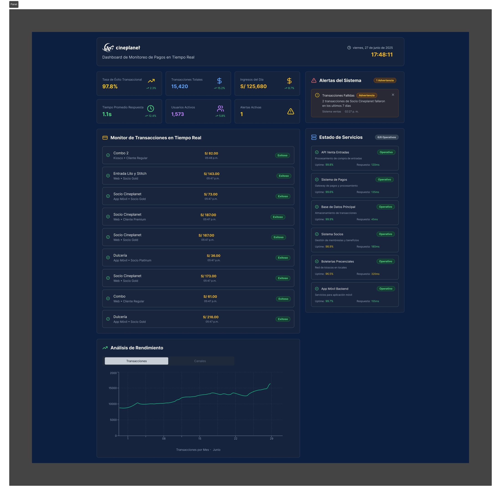

# 📖 Manual de Usuario - Panel de Monitoreo de Pagos Cineplanet

**🎯 Versión:** 2.0  
**📅 Fecha:** 29 de junio de 2025  
**👥 Dirigido a:** Equipo de Operaciones de TI  
**🏢 Empresa:** Cineplanet S.A.

---

## 📋 Tabla de Contenidos

1. [🚀 Introducción](#-introducción)
2. [🔑 Acceso al Sistema](#-acceso-al-sistema)
3. [🖥️ Interfaz Principal](#️-interfaz-principal)
4. [📊 Panel de KPIs](#-panel-de-kpis)
5. [📱 Monitor de Transacciones](#-monitor-de-transacciones)
6. [🚨 Sistema de Alertas](#-sistema-de-alertas)
7. [🔧 Estado de Servicios](#-estado-de-servicios)
8. [⚡ Protocolos de Acción](#-protocolos-de-acción)
9. [🛠️ Troubleshooting](#️-troubleshooting)
10. [📞 Soporte Técnico](#-soporte-técnico)

---

## 🚀 Introducción

El **Panel de Monitoreo de Pagos** es una herramienta desarrollada en Figma e implementada en producción que permite supervisar en tiempo real todo el ecosistema de pagos de Cineplanet. Este manual te guiará paso a paso para utilizarlo eficientemente.

### 🎯 Objetivos del Panel
- ✅ **Monitoreo Proactivo:** Detectar problemas antes de que afecten a los clientes
- ✅ **Diagnóstico Rápido:** Identificar la causa raíz en segundos
- ✅ **Prevención de Fallos:** Reducir el tiempo de respuesta de 48 horas a 2 minutos
- ✅ **Mejora Continua:** Mantener una tasa de éxito superior al 95%

---

## 🔑 Acceso al Sistema

### 📝 Requisitos Previos
- 🌐 **Navegador:** Chrome, Firefox o Edge (última versión)
- 🔐 **Credenciales:** Usuario y contraseña proporcionados por IT
- 📱 **Resolución:** Mínima 1920x1080 para experiencia óptima

### 🚪 Proceso de Login
1. **Abrir URL:** `https://monitoring.cineplanet.com.pe/payments`
2. **Ingresar Credenciales:**
   - Usuario: `[tu-usuario]@cineplanet.com.pe`
   - Contraseña: `[proporcionada por IT]`
3. **Verificación 2FA:** Código desde la app Authenticator
4. **Dashboard Principal:** Carga automática tras autenticación exitosa

---

## 🖥️ Interfaz Principal



### 🔍 Componentes de la Interfaz

| Zona | Descripción | Función |
|------|-------------|---------|
| 📊 **Panel Superior** | KPIs en tiempo real | Métricas críticas del sistema |
| 📱 **Centro** | Monitor de transacciones | Feed en vivo de todas las transacciones |
| 🚨 **Lateral Derecho** | Sistema de alertas | Notificaciones automáticas |
| 🔧 **Panel Inferior** | Estado de servicios | Salud de microservicios |

---

## 📊 Panel de KPIs

### 📈 Métricas Principales

#### 🎯 Tasa de Éxito
- **🟢 NORMAL:** ≥ 95%
- **🟡 ATENCIÓN:** 90-94%
- **🔴 CRÍTICO:** < 90%

**📋 Procedimiento:**
1. **Verificar al inicio del turno**
2. **Monitorear cada 15 minutos**
3. **Si cae < 90% por +5 min → Protocolo Nivel 1**

#### ⚡ Tiempo de Respuesta
- **🟢 NORMAL:** ≤ 2 segundos
- **🟡 ATENCIÓN:** 2-4 segundos
- **🔴 CRÍTICO:** > 4 segundos

**📋 Procedimiento:**
1. **Observar tendencias**
2. **Aumento súbito = Problemas de latencia**
3. **Revisar Estado de Servicios inmediatamente**

#### 💳 Transacciones por Minuto
- **📊 Promedio:** 150-300 TPM
- **⚡ Pico:** 500+ TPM (17:00-20:00h)
- **🌙 Valle:** 50-100 TPM (02:00-06:00h)

---

## 📱 Monitor de Transacciones

### 👁️ Interpretación del Feed

#### 🔍 Columnas del Monitor
| Campo | Descripción | Valores |
|-------|-------------|---------|
| **⏰ Timestamp** | Hora exacta | HH:MM:SS |
| **🆔 ID Transacción** | Identificador único | TXN-XXXXXXXX |
| **💳 Método de Pago** | Tipo de tarjeta/billetera | Visa, Mastercard, Yape, etc. |
| **💰 Monto** | Valor de la transacción | S/. XX.XX |
| **✅ Estado** | Resultado | Exitosa, Fallida, Pendiente |

#### 🚨 Patrones Críticos a Detectar

##### 🔴 Patrón 1: Fallos Consecutivos por Método
```
❌ 14:32:15 | TXN-12345678 | Mastercard | S/. 45.00 | Fallida
❌ 14:32:20 | TXN-12345679 | Mastercard | S/. 32.50 | Fallida
❌ 14:32:25 | TXN-12345680 | Mastercard | S/. 28.00 | Fallida
```
**⚠️ ACCIÓN:** Problema específico con pasarela Mastercard

##### 🔴 Patrón 2: Aumento de Fallos Generales
```
❌ 14:30:00 | 3 fallos por minuto
❌ 14:31:00 | 7 fallos por minuto  
❌ 14:32:00 | 12 fallos por minuto
```
**⚠️ ACCIÓN:** Problema sistémico general

---

## 🚨 Sistema de Alertas

### 🤖 Tipos de Alertas Automáticas

#### 🔥 Nivel Crítico (Rojo)
- **📊 "Tasa de Fallos > 15%"**
- **⚡ "Tiempo de Respuesta > 5s"**
- **🔧 "Servicio Crítico Caído"**

#### ⚠️ Nivel Advertencia (Amarillo)
- **📈 "Incremento de Fallos Detectado"**
- **🐌 "Latencia Elevada"**
- **🔄 "Servicio en Recuperación"**

#### ℹ️ Nivel Información (Azul)
- **✅ "Sistema Recuperado"**
- **📊 "Métricas Normalizadas"**
- **🔄 "Mantenimiento Programado"**

### 📋 Protocolo de Respuesta a Alertas

#### 🚨 Alerta Crítica
1. **⏰ Tiempo máximo de respuesta:** 2 minutos
2. **🔍 Revisar Estado de Servicios**
3. **📞 Notificar al supervisor**
4. **📝 Documentar en log de incidencias**

#### ⚠️ Alerta de Advertencia
1. **⏰ Tiempo máximo de respuesta:** 5 minutos
2. **👁️ Monitorear evolución**
3. **📊 Verificar métricas relacionadas**
4. **🔄 Preparar escalamiento si empeora**

---

## 🔧 Estado de Servicios

### 🟢🔴 Indicadores de Salud

#### 🎯 Servicios Críticos

| Servicio | Función | Estado Normal |
|----------|---------|---------------|
| **🛒 API Venta Entradas** | Procesamiento de compras | 🟢 Verde |
| **💳 Sistema de Pagos** | Gateway de pagos | 🟢 Verde |
| **🗄️ Base de Datos Principal** | Almacenamiento | 🟢 Verde |
| **🔐 Autenticación** | Login y seguridad | 🟢 Verde |
| **📱 API Mobile** | App móvil | 🟢 Verde |

### 🔍 Diagnóstico por Color

#### 🟢 Verde - Operativo
- **Estado:** Funcionamiento normal
- **Acción:** Ninguna acción requerida
- **Frecuencia de Check:** Cada 30 segundos

#### 🟡 Amarillo - Degradado
- **Estado:** Funcionamiento con limitaciones
- **Acción:** Monitoreo intensivo
- **Escalamiento:** Si persiste > 10 minutos

#### 🔴 Rojo - Fallo
- **Estado:** Servicio no disponible
- **Acción:** Protocolo de emergencia inmediato
- **Escalamiento:** Inmediato al equipo técnico

---

## ⚡ Protocolos de Acción

### 🚨 Protocolo Nivel 1 - Crítico

#### 📋 Checklist Inmediato (2 minutos)
- [ ] **🔍 Identificar servicio afectado**
- [ ] **📊 Verificar alcance del problema**
- [ ] **📞 Notificar a supervisor**
- [ ] **📝 Crear ticket de incidencia**
- [ ] **👥 Activar equipo de respuesta**

#### 📞 Contactos de Emergencia
```
🏢 Supervisor de Turno: ext. 2001
⚡ Soporte Técnico: ext. 2500
🔧 DevOps Team: ext. 2300
💳 Proveedores de Pago: 
  - Visa: 01-6001234
  - Mastercard: 01-6005678
```

### ⚠️ Protocolo Nivel 2 - Advertencia

#### 📋 Checklist Seguimiento (5 minutos)
- [ ] **👁️ Monitoreo continuo**
- [ ] **📊 Análisis de tendencias**
- [ ] **📝 Documentar observaciones**
- [ ] **🔄 Evaluar escalamiento**

### 🆘 Protocolo de Escalamiento

#### 🔴 Escalamiento Inmediato
- **Condiciones:**
  - Tasa de fallos > 20%
  - Servicio crítico caído > 2 minutos
  - Múltiples servicios afectados

#### 🟡 Escalamiento Programado
- **Condiciones:**
  - Degradación persistente > 15 minutos
  - Múltiples alertas menores
  - Tendencia negativa sostenida

---

## 🛠️ Troubleshooting

### 🔧 Problemas Comunes

#### 🖥️ Panel No Carga
**❓ Síntomas:** Pantalla en blanco, error de conexión
**🔧 Soluciones:**
1. **🔄 Refrescar página** (Ctrl + F5)
2. **🌐 Verificar conexión a internet**
3. **🔐 Re-autenticarse**
4. **🧹 Limpiar caché del navegador**

#### 📊 Datos No Actualizan
**❓ Síntomas:** Timestamps antiguos, métricas estáticas
**🔧 Soluciones:**
1. **🔄 Verificar conexión WebSocket**
2. **📱 Revisar estado del servicio de datos**
3. **🔌 Reconectar al sistema**
4. **📞 Contactar a soporte**

#### 🚨 Alertas No Aparecen
**❓ Síntomas:** Problemas evidentes sin notificación
**🔧 Soluciones:**
1. **🔊 Verificar configuración de notificaciones**
2. **🔧 Revisar filtros de alertas**
3. **🔄 Reiniciar componente de alertas**
4. **📝 Reportar a administrador**

### 📱 Compatibilidad de Navegadores

| Navegador | Versión Mínima | Estado |
|-----------|----------------|--------|
| 🟢 **Chrome** | 90+ | ✅ Totalmente compatible |
| 🟢 **Firefox** | 88+ | ✅ Totalmente compatible |
| 🟢 **Edge** | 90+ | ✅ Totalmente compatible |
| 🟡 **Safari** | 14+ | ⚠️ Funcionalidad limitada |

---

## 📞 Soporte Técnico

### 🆘 Canales de Soporte

#### 📱 Soporte Inmediato (24/7)
- **☎️ Teléfono:** +51-1-234-5678
- **💬 Chat Interno:** `/support` en Slack
- **📧 Email Urgente:** `ops-emergency@cineplanet.com.pe`

#### 📝 Soporte General
- **🎫 Sistema de Tickets:** `https://helpdesk.cineplanet.com.pe`
- **📧 Email:** `it-support@cineplanet.com.pe`
- **📚 Base de Conocimiento:** `https://kb.cineplanet.com.pe`

### 📋 Información para Reportes

Al contactar soporte, incluir:
- 🆔 **Usuario que reporta**
- ⏰ **Timestamp del problema**
- 🖥️ **Navegador y versión**
- 📝 **Descripción detallada**
- 📊 **Métricas observadas**
- 📸 **Screenshots si es posible**

---

## 📚 Anexos

### 📖 Glosario de Términos

| Término | Definición |
|---------|------------|
| **TPM** | Transacciones Por Minuto |
| **KPI** | Key Performance Indicator |
| **CSAT** | Customer Satisfaction Score |
| **ROI** | Return on Investment |
| **API** | Application Programming Interface |
| **WebSocket** | Protocolo de comunicación en tiempo real |

### 🔗 Enlaces Útiles

- 🎨 **[Prototipo en Figma](https://www.figma.com/proto/QJ3h36nyhVtHRiBPRNNjZH/Untitled?node-id=107-1679&p=f&t=UkvGg56056DcIGnJ-1&scaling=min-zoom&content-scaling=fixed&page-id=107%3A808&starting-point-node-id=107%3A1679&show-proto-sidebar=1)**
- 📊 **[Dashboard Principal](https://monitoring.cineplanet.com.pe/payments)**
- 📚 **[Documentación Técnica](https://docs.cineplanet.com.pe/monitoring)**
- 🎓 **[Centro de Capacitación](https://training.cineplanet.com.pe)**

---

**📝 Nota:** Este manual se actualiza regularmente. Última actualización: 29 de junio de 2025.

**💡 Tip:** Mantén este manual accesible durante tu turno y no dudes en consultarlo ante cualquier duda.

---

> 🚀 **¡Importante!** El éxito del sistema depende del uso correcto de esta herramienta. Tu trabajo como operador es crucial para mantener la excelencia en los pagos de Cineplanet.
